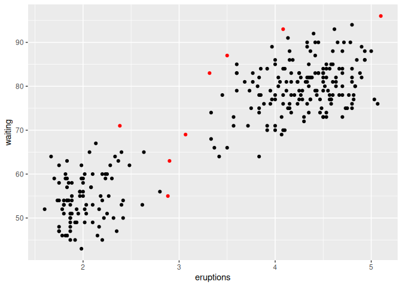
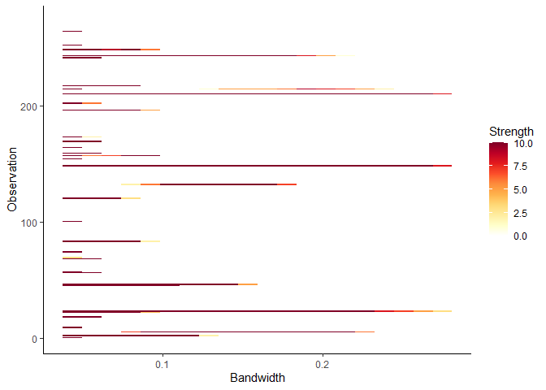

<!-- README.md is generated from README.Rmd. Please edit that file -->

# lookout

**lookout** identifies outliers in data using leave-one-out kernel
density estimates and extreme value theory. The bandwidth for kernel
density estimates is computed using persistent homology, a technique in
topological data analysis. Using peak-over-threshold method, a
generalized Pareto distribution is fitted to the log of leave-one-out
kde values to identify outliers.

See [Kandanaarachchi and Hyndman
(2021)](https://robjhyndman.com/publications/lookout/) for the
underlying methodology.

## Installation

You can install the released version of lookout from
[CRAN](https://CRAN.R-project.org) with:

``` r
#install.packages("lookout")
```

And the development version from [GitHub](https://github.com/) with:

``` r
# install.packages("devtools")
devtools::install_github("sevvandi/lookout")
```

## Example

``` r
library(lookout)
lo <- lookout(faithful)
lo
#> Leave-out-out KDE outliers using lookout algorithm
#> 
#> Call: lookout(X = faithful)
#> 
#>   Outliers Probability
#> 1       24  0.01371435
#> 2      149  0.00000000
#> 3      211  0.00000000
autoplot(lo)
```



``` r
persistence <- persisting_outliers(faithful)
autoplot(persistence)
```


