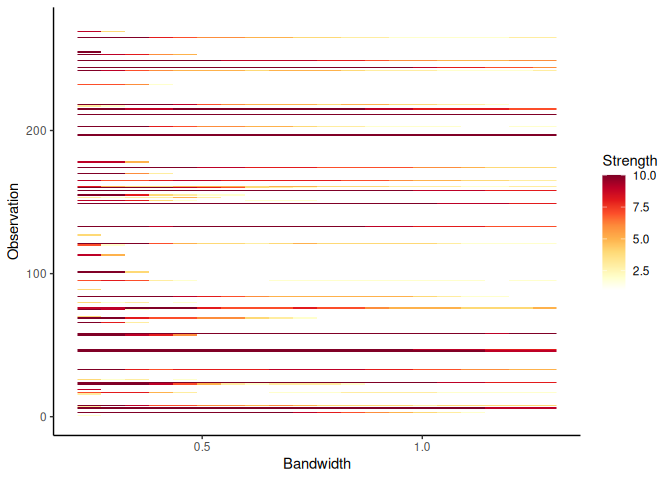

<!-- README.md is generated from README.Rmd. Please edit that file -->

# lookout 

<!-- badges: start -->

[](https://github.com/sevvandi/lookout/actions/workflows/R-CMD-check.yaml)
[](https://CRAN.R-project.org/package=lookout)
<!-- badges: end -->

**lookout** identifies outliers in data using leave-one-out kernel
density estimates and extreme value theory. The bandwidth for kernel
density estimates is computed using persistent homology, a technique in
topological data analysis. Using the peak-over-threshold method, a
Generalized Pareto Distribution is fitted to the log of leave-one-out
kde values to identify outliers.

See [Kandanaarachchi and Hyndman
(2021)](https://robjhyndman.com/publications/lookout/) for the
underlying methodology.

## Installation

You can install the released version of lookout from
[CRAN](https://CRAN.R-project.org) with:

``` r
#install.packages("lookout")
```

And the development version from [GitHub](https://github.com/) with:

``` r
# install.packages("devtools")
devtools::install_github("sevvandi/lookout")
```

## Example

``` r
library(lookout)
lo <- lookout(faithful)
lo
#> Leave-out-out KDE outliers using lookout algorithm
#> 
#> Call: lookout(X = faithful)
#> 
#>   Outliers Probability
#> 1        6 0.005553188
#> 2       24 0.006423949
#> 3       46 0.007934127
#> 4      149 0.008300670
#> 5      158 0.007242257
#> 6      197 0.004333429
#> 7      211 0.000000000
#> 8      244 0.004956339
autoplot(lo)
```


Next we look at outlier persistence. The outlier persistence plot shows
the outliers that persist over a range of bandwidth values for different
levels of significance. The strength is inversely proportional to the
level of significance. If the level of significance is 0.01, then the
strength is 10 and if it is 0.1, then the strength is 1.

``` r
persistence <- persisting_outliers(faithful)
autoplot(persistence)
```


